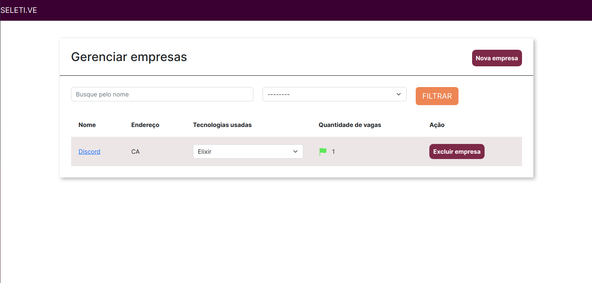
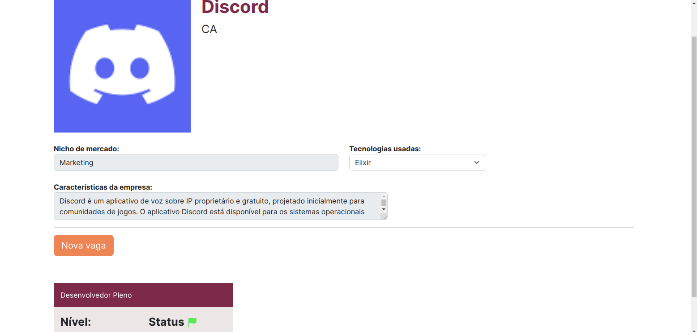
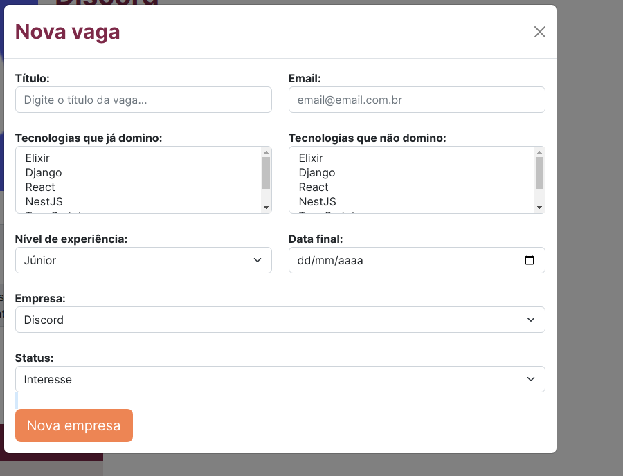
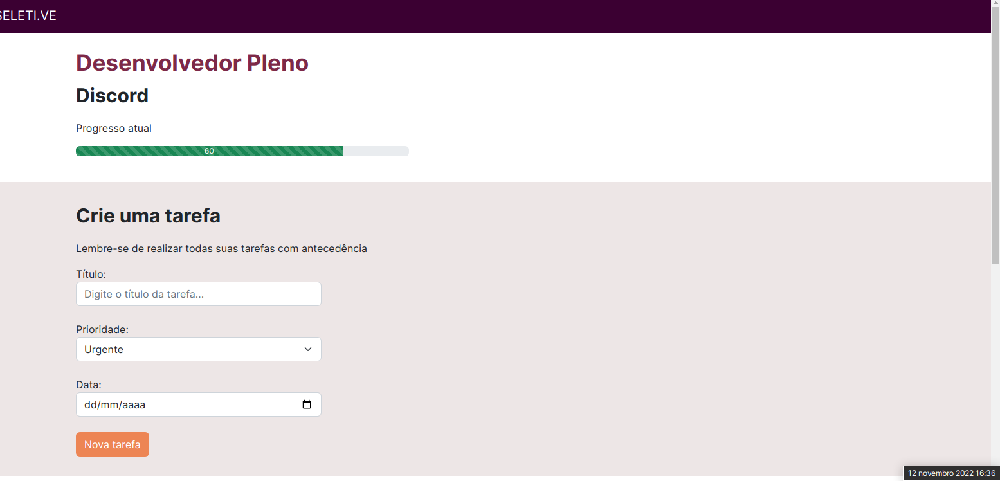

<p align="center">
  <a href="https://www.djangoproject.com" target="blank"></a>
</p>

<p align="center">

  <a href="#-tecnologias">Tecnologias</a>&nbsp;&nbsp;&nbsp;|&nbsp;&nbsp;&nbsp;

  <a href="#-projeto">Projeto</a>&nbsp;&nbsp;&nbsp;|&nbsp;&nbsp;&nbsp;

  <a href="#-como-executar">Como executar</a>&nbsp;&nbsp;&nbsp;|&nbsp;&nbsp;&nbsp;

  <a href="#-licença">Licença</a>

</p>

<p align="center">

  

</p>

<br>

<a id="-tecnologias"></a>

## ✨ Tecnologias

Esse projeto foi desenvolvido com as seguintes tecnologias:


<a id="-projeto"></a>

## 💻 Projeto

O projeto Seletive é uma ideia de aplicação desenvolvida para recrutadores e pessoas que procuram uma vaga de emprego, a plataforma tem como objetivo facilitar essa ação.

<p align="center">

  

</p>

  <p align="center">



</p>

<p align="center">

  

</p>

<p align="center">

  

</p>

<a id="-como-executar"></a>

## 🚀 Como executar

### 💻 Pré-requisitos

Antes de começar, verifique se você atendeu aos seguintes requisitos:

- Você instalou a versão mais recente de `< Docker & Python>`

- Você tem uma máquina `< Windows / Linux / Mac >`.

- Você possui um `< Editor de código ou IDE / Gerenciador de banco de dados >`.

## ☕ Pequena ajuda

Preencha o arquivo `.env.example` com as informações cobradas e depois renomeie para `.env`.

```env
# APP

SECRET_KEY=
DEBUG=
HOSTS=

# POSTGRES
POSTGRES_DB=
POSTGRES_USER=
POSTGRES_PASSWORD=

# PGADMIN
PGADMIN_DEFAULT_EMAIL=
PGADMIN_DEFAULT_PASSWORD=

```

### Se lembre de ter o Docker rodando :ocean:

E então, rode o comando `docker-compose up --build -V`.

Agora você pode acessar [localhost:8000/home/empresas](localhost:8000/home/empresas) do seu navegador.

<a id="licença"></a>

## 📄 Licença

Esse projeto está sob a licença MIT. Veja o arquivo [LICENSE](../LICENSE.md) para mais detalhes.

---

#### _Sinta-se livre para colaborar, toda ajuda é bem vinda ;)_
